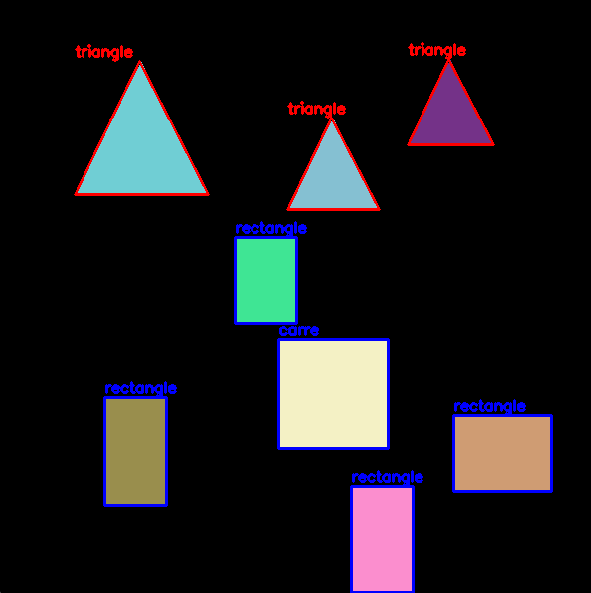

# Geometric Shape Detection with OpenCV

Projet de Vision par Ordinateur focalisé sur la détection et la classification géométrique de formes 2D.
L'objectif est de générer des datasets synthétiques propres et d'identifier des formes (Triangles, Carrés, Rectangles, Cercles) via analyse de contours.

## Démo

Voici le résultat de la détection sur un dataset généré au hasard grâce au gen_data.py :

*(Le script identifie la forme, dessine le contour et adapte la couleur selon la classe détectée)*

## Fonctionnalités

* **Génération de Données "Collision-Free"** : 
    * Le script `gen_data.py` intègre un algorithme de placement intelligent.
    * Utilisation d'un **masque d'occupation avec marge de sécurité (dilatation)** pour garantir qu'aucune forme ne se superpose ou ne touche les autres, assurant une précision de détection optimale.
* **Pipeline de Vision** :
    * Prétraitement : Grayscale & Flou Gaussien.
    * **Canny Edge Detection** : Extraction précise des bords pour la définition des contours.
* **Classification Algorithmique** :
    * Approximation polygonale via **Ramer-Douglas-Peucker** (`cv2.approxPolyDP`).
    * Classification logique basée sur le nombre de sommets :
        * 3 sommets ➝ Triangle
        * 4 sommets ➝ Calcul du Ratio (Largeur/Hauteur) pour différencier Carré vs Rectangle.
        * \> 4 sommets ➝ Cercle.